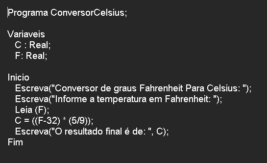

# CelsiusEmLPP

**Celsius em LPP, Português Estruturado, Portugol, Potigol, Pseudocódigo, Pseudolinguagem, Metalinguagem**

## Enunciado

**Ler uma temperatura em graus Fahrenheit e apresentá-la convertida em graus Celsius. A fórmula de conversão é C = (F-32) \* (5/9), sendo F a temperatura em Fahrenheit e C a temperatura em Celsius.**

   

Autor: Erick Leite Freire 
Criado em: 03-01-2024 
Site: [Escola do Autodidata](https://www.escoladoautodidata.com.br) 
